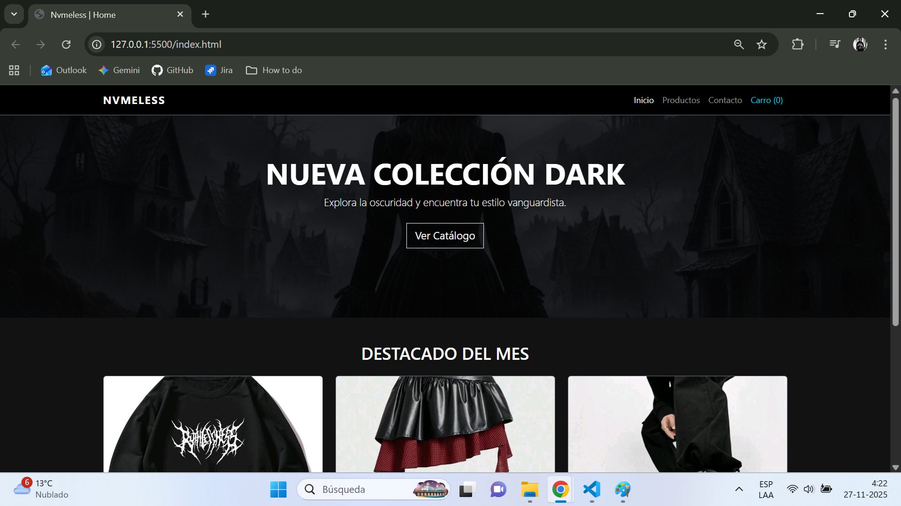
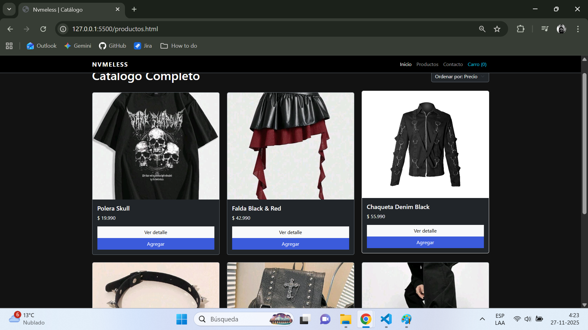
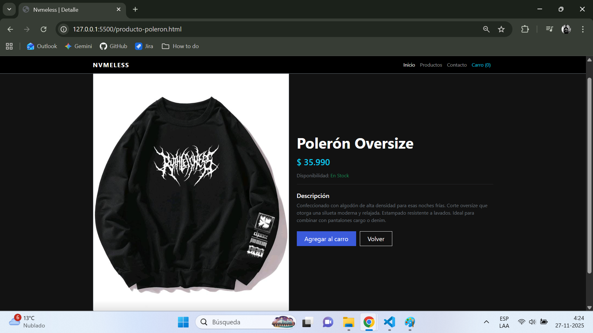

# 🌑 Nvmeless Store | E-commerce Front End

> Proyecto del Módulo 2: Fundamentos del desarrollo Front End.
> **Bootcamp Desarrollo de Aplicaciones Full Stack JavaScript Trainee.**

## 📖 Descripción del Proyecto
**Nvmeless** es un prototipo de tienda e-commerce con una estética **Gótica/Dark** y vanguardista. El objetivo de este proyecto es demostrar el dominio de la maquetación web utilizando HTML5 semántico, CSS3 y el framework **Bootstrap 5**.
El sitio simula una tienda de ropa alternativa, permitiendo al usuario navegar desde una portada promocional, pasar por un catálogo de productos en grilla y acceder al detalle individual de cada artículo.

## 🛠 Tecnologías Utilizadas
- **HTML5 Semántico:** Estructura clara y accesible.
- **CSS3:** Estilos personalizados (`assets/css/styles.css`), uso de `object-fit` para control de imágenes y diseño visual oscuro.
- **Bootstrap 5.3 (CDN):** Sistema de grillas (Grid), Navbar responsive, Cards y componentes de utilidad.
- **Git / GitHub:** Control de versiones y flujo de trabajo.

## 🎨 Diseño y Estética

Se optó por un diseño **Dark Mode** por defecto para alinearse con la identidad de la marca:

* **Fondo:** `#121212` (Negro suave para evitar fatiga visual).
* **Acentos:** `#3b5bdb` (Azul digital) para llamadas a la acción (CTA).
* **Tipografía:** *Segoe UI* y sans-serif para una lectura limpia y moderna.
* **Efectos:** Transiciones suaves (`hover`) en las tarjetas de productos para mejorar la UX.

## 📸 Capturas de Pantalla

### Vista Home

### Catálogo de Productos

### Detalle de Producto

## 📂 Estructura del Proyecto
El proyecto sigue una organización de carpetas estándar para separar la estructura, los estilos y los recursos multimedia:

nvmeless-ecommerce/
│
├── index.html                   # Página de Inicio
├── productos.html               # Catálogo completo
│
├── producto-polera.html         # Detalle: Polera Skull
├── producto-falda.html          # Detalle: Falda Black & Red
├── producto-chaqueta.html       # Detalle: Chaqueta Denim
├── producto-botas.html          # Detalle: Botas Platform
├── producto-accesorio.html      # Detalle: Choker Spikes
├── producto-mochila.html        # Detalle: Mochila Gothic Cross
├── producto-poleron.html        # Detalle: Polerón Oversize
│
├── README.md                    # Documentación del proyecto
│
└── assets/
    ├── css/
    │   └── styles.css           # Estilos personalizados
    │
    └── img/                     # Banco de imágenes
        ├── accesorio-goth.jpeg
        ├── botas-platform.jpeg
        ├── captura-catalogo.png
        ├── captura-detalle.png
        ├── captura-home.png
        ├── chaqueta-denim.jpg
        ├── falda-goth..jpg
        ├── hero-banner.png
        ├── mochila-canvas.jpeg
        ├── polera-graphic.jpeg
        ├── poleron-oversize.jpeg

## Versionamiento
git init
git add index.html productos.html assets/css/styles.css
git commit -m "estructura base y estilos"
git add producto-accesorio.html producto-botas.html producto-chaqueta.html producto-falda.html producto-mochila.html producto-polera.html producto-poleron.html
git commit -m "Adhesión de páginas estáticas para cada producto"
git add producto-polera.html producto-falda.html producto-chaqueta.html producto-botas.html producto-accesorio.html producto-mochila.html producto-poleron.html
git commit -m "adhesión banner e imagenes catalogo"
git add README.md
git commit -m "documentación proyecto"
git add README.md
git commit -m "actualización del archivo README.md"

## 🚀 Cómo visualizar el proyecto
Clona o descarga este repositorio.
Asegúrate de tener conexión a internet (necesaria para cargar Bootstrap vía CDN).
Abre el archivo index.html en tu navegador web de preferencia.
Recomendación: Para una mejor experiencia, utiliza la extensión Live Server de Visual Studio Code.

👤 Autor
Luis Fiedler - Desarrollador en formación